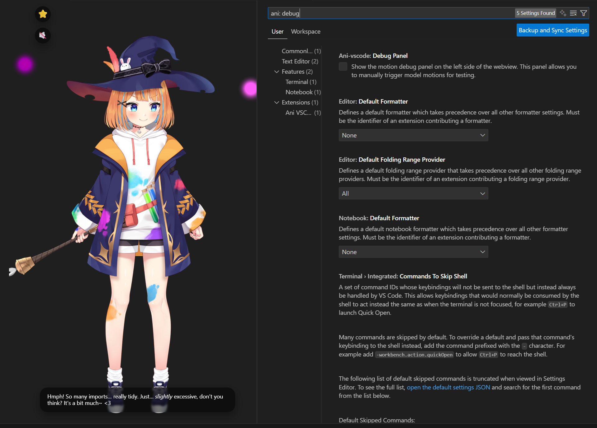

Ani VSCode
==========

VSCode extension that shows a 2D character who watches you code. Think of it like a LLM-powered Clippy for VSCode.

Disclaimer: The project is almost entirely vibe-coded

# Screenshots
|  |  |
| --- | --- |

# Features
- Follow your editor caret position and mouse movements if you click inside the panel
- Comments on your code
- Read news from HackerNews + RSS Feeds and comment on the news
- Comments on anything on your screen (disabled by default)
- Can talk (using text to speech with pitch adjustment and lipsync)
- Nudges you to take short breaks after long coding streaks

# Usage
- Open command panel (Cmd+Shift+P on MacOS), run "Ani: Show Assistant Panel" command.

# Build
- From this folder: `npm install` then `npm run build`.
- Optional: `npm run typecheck` to run the TypeScript compiler without emitting files.

# Package
- Ensure dependencies are installed, then run `npm run package` to create a `.vsix` artifact using `vsce` in the project root.

# Debugging
- Open the project in VSCode, Run > Start Debugging

## Settings
| Setting | Type | Default | Description |
| --- | --- | --- | --- |
| `ani-vscode.transparentBackground` | boolean | `true` | Render the webview with a transparent background so Ani blends with your theme. |
| `ani-vscode.character` | string (`Hiyori` \| `Mao`) | `Mao` | Choose which Live2D model loads when the panel opens. |
| `ani-vscode.debugPanel` | boolean | `false` | Show the motion debug panel to trigger animations manually. |
| `ani-vscode.llm.baseUrl` | string | `"http://localhost:11434/v1/"` | Base URL for an OpenAI-compatible chat completion API. |
| `ani-vscode.llm.apiKey` | string | `"dummy"` | API key stored in VS Code settings (hidden in the UI). Replace with your provider key. |
| `ani-vscode.llm.model` | string | `"gemma3:12b-it-qat"` | Primary model used for longer responses (e.g., `gpt-4.1-mini`). |
| `ani-vscode.llm.fastModel` | string | `"gemma3:1b-it-qat"` | Lightweight model for quick expression updates. Leave empty to disable expression animations. |
| `ani-vscode.llm.minIntervalSeconds` | number | `10` | Minimum seconds between LLM requests |
| `ani-vscode.llm.maxHistory` | number | `5` | Maximum number of messages to keep in chat history (including system message). |

## Plugins
| Setting | Type | Default | Description |
| --- | --- | --- | --- |
| `ani-vscode.plugins.periodicIntervalMinutes` | number | `1` | Minutes between automatic plugin triggers. Set to `0` to disable. |
| `ani-vscode.plugins.codeReview.enabled` | boolean | `true` | Enable the Code Review plugin that analyzes your code. |
| `ani-vscode.plugins.codeReview.weight` | number | `1` | Weight controlling how often the Code Review plugin runs. |
| `ani-vscode.plugins.hackerNews.enabled` | boolean | `true` | Fetch top stories from HackerNews for Ani to discuss. |
| `ani-vscode.plugins.hackerNews.weight` | number | `1` | Weight controlling how often the HackerNews plugin runs. |
| `ani-vscode.plugins.rssFeed.enabled` | boolean | `true` | Let Ani read and summarize articles from custom RSS feeds. |
| `ani-vscode.plugins.rssFeed.weight` | number | `1` | Weight controlling how often the RSS Feed plugin runs. |
| `ani-vscode.plugins.rssFeed.feeds` | string[] | `["https://www.channelnewsasia.com/api/v1/rss-outbound-feed?_format=xml"]` | List of RSS feed URLs; one is chosen at random per trigger. |
| `ani-vscode.plugins.breakReminder.enabled` | boolean | `true` | Enable break reminders when you've been heads-down for a while. |
| `ani-vscode.plugins.breakReminder.weight` | number | `1` | Weight controlling how often the Break Reminder plugin runs. |
| `ani-vscode.plugins.breakReminder.activeMinutes` | number | `10` | Minutes of continuous coding before Ani suggests pausing. |
| `ani-vscode.plugins.breakReminder.cooldownMinutes` | number | `5` | Minimum minutes to wait before Ani offers another break. |
| `ani-vscode.plugins.screenshot.enabled` | boolean | `false` | Capture your workspace and send it to a vision-capable LLM for commentary. |
| `ani-vscode.plugins.screenshot.weight` | number | `2` | Weight controlling how often the screenshot plugin runs. |

> **Tip:** Weights are relative. Doubling one plugin’s weight roughly doubles its chance of being picked compared to another that stays at `1`.
